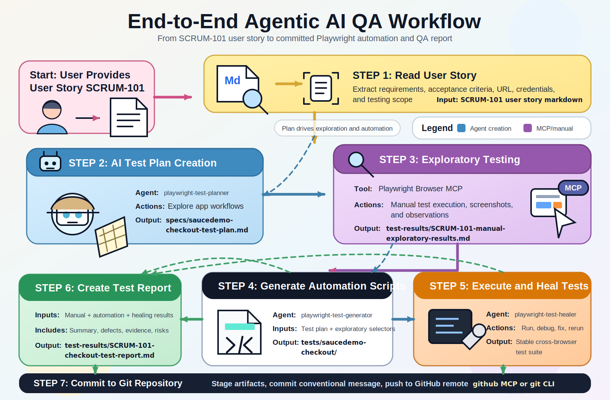

# Playwright Planner, Executor, and Healer Workflow

This repository contains an end-to-end QA workflow for SCRUM-101, the SauceDemo checkout user story. It uses MCP browser/test servers, Playwright, and local agent prompt files to go from a user story to a test plan, exploratory results, automated tests, healing, reporting, and Git commit/push.

## What Is Included



| Path | Purpose |
| --- | --- |
| `skill.md` | Master prompt defining the 7-step workflow. |
| `docs/diagrams/end-to-end-agentic-ai-qa-workflow.svg` | Editable visual workflow diagram for all seven QA steps. |
| `docs/diagrams/end-to-end-agentic-ai-qa-workflow.png` | Rendered PNG version of the workflow diagram for sharing. |
| `user-stories/SCRUM-101-ecommerce-checkout.md` | Input user story, acceptance criteria, app URL, and credentials. |
| `specs/saucedemo-checkout-test-plan.md` | Comprehensive checkout test plan. |
| `tests/saucedemo-checkout/` | Playwright automation suite for checkout scenarios. |
| `test-results/SCRUM-101-manual-exploratory-results.md` | Manual exploratory execution notes. |
| `test-results/SCRUM-101-checkout-test-report.md` | Final consolidated execution report. |
| `test-results/evidence/` | Manual evidence screenshots. |
| `.github/agents/` | Planner, generator, and healer agent definitions. |
| `.vscode/mcp.json` | MCP server configuration for compatible clients. |

## Software Requirements

- Node.js 20 LTS or newer
- npm
- Git
- Playwright-supported browsers: Chromium, Firefox, and WebKit
- A Codex, VS Code, or MCP-capable client that can read `.vscode/mcp.json`
- Network access to:
  - `https://www.saucedemo.com`
  - npm registry, for installing dependencies and MCP packages
  - GitHub, if pushing workflow output

## Project Setup

Install dependencies:

```bash
npm ci
```

Install Playwright browsers:

```bash
npx playwright install --with-deps
```

On macOS, `--with-deps` is harmless but mostly useful on Linux CI. For a local-only browser install, this is also fine:

```bash
npx playwright install
```

## MCP Servers Required

The workflow expects the MCP servers configured in `.vscode/mcp.json`.

| Server | Command or URL | Required For |
| --- | --- | --- |
| `playwright` | `npx @playwright/mcp@latest` | Manual browser exploration, snapshots, screenshots, and interaction. |
| `playwright-test` | `npx playwright run-test-mcp-server` | Planner/generator/healer style test operations. |
| `github` | `https://api.githubcopilot.com/mcp/` | GitHub MCP operations when available. Normal `git` CLI can also be used. |

The GitHub MCP server uses this environment variable:

```bash
export GITHUB_MCP_TOKEN="<token>"
```

Do not place raw GitHub tokens in `.vscode/mcp.json` or commit them to the repository.

## Workflow Inputs

The main input file is:

```text
user-stories/SCRUM-101-ecommerce-checkout.md
```

Current story inputs:

| Input | Value |
| --- | --- |
| Application URL | `https://www.saucedemo.com` |
| Username | `standard_user` |
| Password | `secret_sauce` |
| Target browsers | Chromium, Firefox, WebKit |
| Main workflow prompt | `skill.md` |

## Running The Full Workflow

Follow the 7-step workflow in `skill.md`.

1. Read the user story and summarize requirements, acceptance criteria, credentials, and test scope.
2. Use the Playwright MCP browser tools to explore SauceDemo and create `specs/saucedemo-checkout-test-plan.md`.
3. Execute the planned scenarios manually with Playwright MCP browser tools and capture evidence screenshots.
4. Generate Playwright automation under `tests/saucedemo-checkout/`.
5. Run and heal the automation until it is stable across all configured browsers.
6. Create `test-results/SCRUM-101-checkout-test-report.md` from manual, automation, and healing results.
7. Commit and push all intended artifacts to the configured GitHub repository.

## Running Automated Tests

Run the full Playwright suite:

```bash
npm test
```

Run only the SCRUM-101 checkout suite:

```bash
npm run test:checkout
```

Run with line reporter:

```bash
npx playwright test tests/saucedemo-checkout --reporter=line
```

Run a single browser project:

```bash
npx playwright test tests/saucedemo-checkout --project=chromium
```

Open the HTML report after a run:

```bash
npx playwright show-report
```

## Test Output Locations

| Output | Location | Committed |
| --- | --- | --- |
| Final QA reports | `test-results/*.md` | Yes |
| Evidence screenshots | `test-results/evidence/*.png` | Yes |
| Playwright raw artifacts | `playwright-artifacts/` | No |
| Playwright HTML report | `playwright-report/` | No |

Playwright raw output is configured in `playwright.config.ts` as:

```ts
outputDir: './playwright-artifacts/test-results'
```

This prevents automated test runs from deleting the curated reports and screenshots in `test-results/`.

## Automation Design Notes

- Tests use stable `data-test` selectors from SauceDemo.
- Browser projects are configured in `playwright.config.ts` for Chromium, Firefox, and WebKit.
- `tests/saucedemo-checkout/checkout.helpers.ts` contains shared login, cart, and checkout helpers.
- Known product defects are represented with `test.fail()` in `checkout-known-defects.spec.ts`. This keeps the suite stable while still executing the defect checks.

## Known Product Defects

| Bug ID | Summary |
| --- | --- |
| `SCRUM-101-BUG-001` | Cart page does not display subtotal, tax, or total calculation required by AC1. |
| `SCRUM-101-BUG-002` | Invalid special-character names and non-numeric postal code are accepted. |
| `SCRUM-101-BUG-003` | Empty cart can proceed to checkout. |

## Git Tasks

Initialize the repository if needed:

```bash
git init -b main
git remote add origin https://github.com/rudrathkr/PlaywrightAgentsPlannerExecutorHealerVSCode.git
```

Stage, commit, and push:

```bash
git add .
git commit -m "feat(tests): Add complete test suite for SCRUM-101 checkout workflow"
git push -u origin main
```

For the completed SCRUM-101 workflow, the pushed commit is:

```text
beb3de2 feat(tests): Add complete test suite for SCRUM-101 checkout workflow
```

## Troubleshooting

If browsers are missing:

```bash
npx playwright install
```

If tests cannot reach SauceDemo, verify network access and try:

```bash
npx playwright test tests/saucedemo-checkout --project=chromium --headed
```

If GitHub MCP authentication fails, set `GITHUB_MCP_TOKEN` in the environment or use the regular `git` CLI with locally configured credentials.

If reports or evidence disappear after a test run, confirm `playwright.config.ts` still points `outputDir` to `./playwright-artifacts/test-results`.
